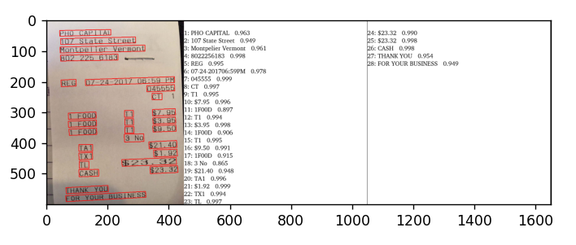

## 1. INSTALL PADDLEOCR

### 1.1. Install PaddlePaddle
- If you have CUDA 9 or CUDA 10 installed on your machine, please run the following command to install
```python
python -m pip install paddlepaddle-gpu -i https://pypi.tuna.tsinghua.edu.cn/simple
```
- If you have no available GPU on your machine, please run the following command to install the CPU version
```python
python -m pip install paddlepaddle -i https://pypi.tuna.tsinghua.edu.cn/simple
```
### 1.2. Install PaddleOCR Whl Package
```python
pip install "paddleocr>=2.0.1" # Recommend to use version 2.0.1+
``` 
## 2. USE PADDLEOCR
### 2.1. With command
- Detection, direction classification and recognition: set the parameter `--use_gpu false` to disable the gpu device, change `./imgs_en/img_12.jpg` to your image path
```python
paddleocr --image_dir ./imgs_en/img_12.jpg --use_angle_cls true --lang en --use_gpu false
```
### 2.2. With Code
- detection, angle classification and recognition image:
```python
from paddleocr import PaddleOCR,draw_ocr
from PIL import Image
import matplotlib.pyplot as plt
# Paddleocr supports Chinese, English, French, German, Korean and Japanese.
# You can set the parameter `lang` as `ch`, `en`, `fr`, `german`, `korean`, `japan`
# to switch the language model in order.
ocr = PaddleOCR(use_angle_cls=True, lang='en') # need to run only once to download and load model into memory
img_path = input("Nhập đường dẫn ảnh: ")
result = ocr.ocr(img_path, cls=True)
#for idx in range(len(result)):
#    res = result[idx]
#    for line in res:
#        print(line)


# draw result
from PIL import Image
result = result[0]
image = Image.open(img_path).convert('RGB')
boxes = [line[0] for line in result]
txts = [line[1][0] for line in result]
scores = [line[1][1] fo254.r line in result]
im_show = draw_ocr(image, boxes, txts, scores, font_path='latin.ttf')
im_show = Image.fromarray(im_show)
#im_show.save('result.jpg')

#print(txts[0][0])
#print(txts[1])

plt.figure()
plt.imshow(im_show)
plt.show()
```
-If you have error `ImportError: cannot import name 'PaddleOCR' from partially initialized module 'paddleocr' (most likely due to a circular import)` 
in line `from paddleocr import PaddleOCR,draw_ocr` you must uninstall paddleocr>=2.0.1 and reinstall paddleocr>=2.0.1:

```python
pip uninstall "paddleocr>=2.0.1" 
```
```python
pip install "paddleocr>=2.0.1"
```
- result:


- If you do not have GPU on your machine, add `use_gpu=False`
```ocr = PaddleOCR(use_angle_cls=True, lang='en', use_gpu=False)```
- If the input is a PDF file, you can refer to the following code for visualization:
```python
from paddleocr import PaddleOCR, draw_ocr

# Paddleocr supports Chinese, English, French, German, Korean and Japanese.
# You can set the parameter `lang` as `ch`, `en`, `fr`, `german`, `korean`, `japan`
# to switch the language model in order.
ocr = PaddleOCR(use_angle_cls=True, lang="ch", page_num=2)  # need to run only once to download and load model into memory
img_path = '156.pdf'
result = ocr.ocr(img_path, cls=True)
for idx in range(len(result)):
    res = result[idx]
    for line in res:
        print(line)

# draw result
import fitz
from PIL import Image
import cv2
import numpy as np
imgs = []
with fitz.open(img_path) as pdf:
    for pg in range(0, pdf.page_count):
        page = pdf[pg]
        mat = fitz.Matrix(2, 2)
        pm = page.get_pixmap(matrix=mat, alpha=False)
        # if width or height > 2000 pixels, don't enlarge the image
        if pm.width > 2000 or pm.height > 2000:
            pm = page.get_pixmap(matrix=fitz.Matrix(1, 1), alpha=False)

        img = Image.frombytes("RGB", [pm.width, pm.height], pm.samples)
        img = cv2.cvtColor(np.array(img), cv2.COLOR_RGB2BGR)
        imgs.append(img)
for idx in range(len(result)):
    res = result[idx]
    image = imgs[idx]
    boxes = [line[0] for line in res]
    txts = [line[1][0] for line in res]
    scores = [line[1][1] for line in res]
    im_show = draw_ocr(image, boxes, txts, scores, font_path='latin.ttf')
    im_show = Image.fromarray(im_show)
    im_show.save('result_page_{}.jpg'.format(idx))
```
- and result:   